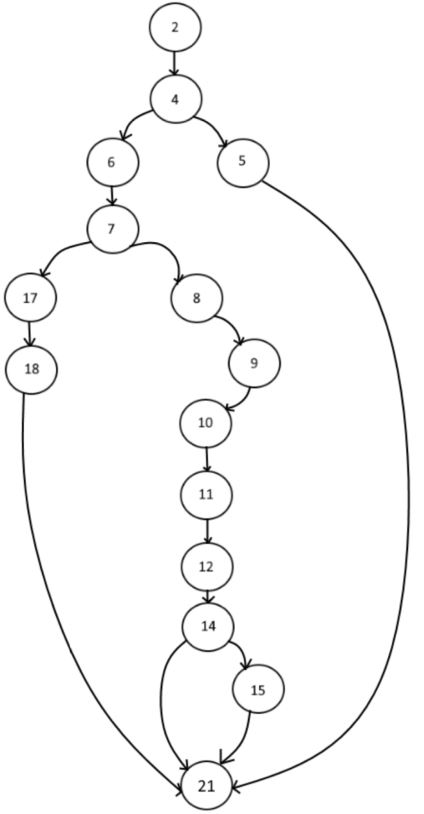

Testing Strategies

1. Event
   1. test_check_name(self)

   Testing Strategies: Branch Coverage 

   Justification: We are using Branch Coverage here as there is only 2 possible branches. Either the Event name is empty or it is not empty. Therefore the each branch would be covered 50 %. This is calculated using:

1. test_check_date(self)

Testing Strategies: Path Coverage and CFG

Justification: Path Coverage is used as in the function, there is a combination of conditions, therefore it is more suited to use this type of whitebox testing. We will use it to check the if statement of:

`            `if year > 2050 or today > date:

`                      `flag = False

In this if statement, it contains 2 conditions and they can be generalised to A and B where:

- A => year > 2050
- B => today > date

We are also using try and Except where if there is a ValueError, the flag variable would turn to False. We also do check whether the date is an empty string of not. Therefore the overall code would be:

1  def check_date(date, today):
2     flag = True
3 
4     if date == '':
5         flag = False
6     else:
7         try:
8             date = date.split('-')
9             day = int(date[2])
10            month = int(date[1])
11            year = int(date[0])
12            date = datetime.date(year,month,day)
13
14            if year > 2050 or today > date:
15                flag = False
16
17        except ValueError:
18            flag = False
19
20
21    return flag

`		`The CFG would be:

1. test_date_not_larger(self)

Testing Strategies: Branch coverage

Justification: We are using Branch Coverage here as there is only 2 possible branches, which are the start date is lesser than or equal to end date or start date is greater than end date. Therefore the each branch would be covered 50 %.

|Test Cases|Input|Expected Ouput|Decision Coverage|Branch coverage|
| :-: | :-: | :-: | :-: | :-: |
|1|
Start date = '2022-09-23'

End date = '2022-09-24'
|True|50%|50%|
|2|
Start date = '2022-09-24'

End date = '2022-09-23'
|False|50%|50%|

1. test\_check\_address(self)

Testing Strategies: Modified Condition/Decision Coverage (MC/DC)

Justification:  In address, we would be checking all the possible combinations conditions and create test cases around it. For address, we have to check whether it is online or it is an address of Australia or United States. Therefore we would make a truth table for this line of code 

*if address != "" and (("Online" in address.upper()) or ("UNITED STATES" in address.upper() or "AUSTRALIA" in address.upper())):* :

- A => Address != “”
- B => Address contains online
- C => Address contains United States
- D => Address contains Australia

A = {1,9}, {2,10}, {3,11}, {4, 12}, {5,13}, {6,14}, {7,15}

B = {4,8}

C = {6,8}

D = {7,8}

In this case, the 5 four tests that satisfy that MC/DC coverage is {1, 4, 6, 7, 8, 9} Therefore, the test cases would be:

|Test Cases|Test case Description|Address|Online|Expected Output|
| :-: | :-: | :-: | :-: | :-: |
|1|Empty address|''|True|False|
|2|Valid online address. Any address is given valid if it contains online|"asdasdasdasdasd"|True|True|
|3|Valid Physical address in Australia|"Mrs Smith 98 Shirley Street PIMPAMA QLD 4209 AUSTRALIA"|False|True|
|4|Valid Physical address in United States|"Mrs Smith 98 Fake Street Ohio Colombus 4209 UNITED STATES"|False|True|
|5|Invalid offline address (Any place outside Australia and US)|"Fake City"|False|False|

1. test\_add\_event(self)

Testing Strategies: Branch coverage

Justification: Branch Coverage is defined as every possible alternative in a branch of the program should be executed once. For the if statement in our add\_event method, we check that the number of attendees is less than or equal to 20. If the condition is true, we add the event using the API and return a success message. If the condition is false, it will return an error message. In our test cases, we used mocking to add the event when the attendees are less than or equal to 20, so the true condition of the branch is executed. Next, we add more than 20 attendees to a temporary event, so the false condition of the branch is executed. This test case passed as both successful and error messages were printed accordingly.

1. test\_delete\_event(self)

Testing Strategies: For deleting events, we check whether the event is on past dates or not. If it is, events can be deleted and return a successful message. If not, events cannot be deleted and return an error message. We apply Branch Coverage by providing two test cases, TC1: '2012-05-28T09:00:00-07:00' and TC2: '2030-05-28T09:00:00-07:00', to make sure that the executed true at least once and false at least once. The test cases created passed as both output are printed correctly. 

Branch coverage for adding and deleting event are actually 100%, by applying the formula, Branch coverage = decisions covered / total number of decisions \* 100. There are two numbers of decisions and both of them are covered.

1. Navigation
   1. Search event by date/year

Testing Strategy: Statement Coverage

Justification: In this method, we used two if statements to check if the input date is equal to the date in the event list, then the next if statement to check if the event list is empty. If there are no events found, the program will actually execute all lines and finally return a message saying that, “No events found”. In our test cases, we use mocking to create a “fake” event list and try to search the list by a given date or year and check whether the program produces the error message given which is “No events found”. This test case shows that we get 100% coverage when the input date is not in the event list.
